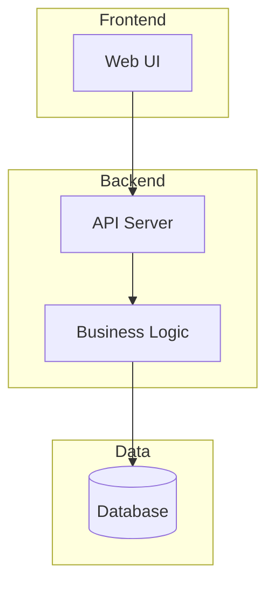
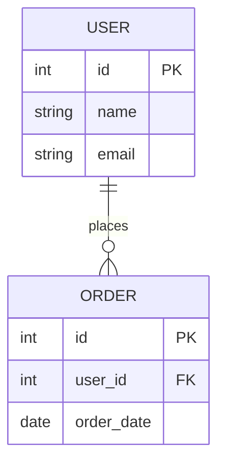
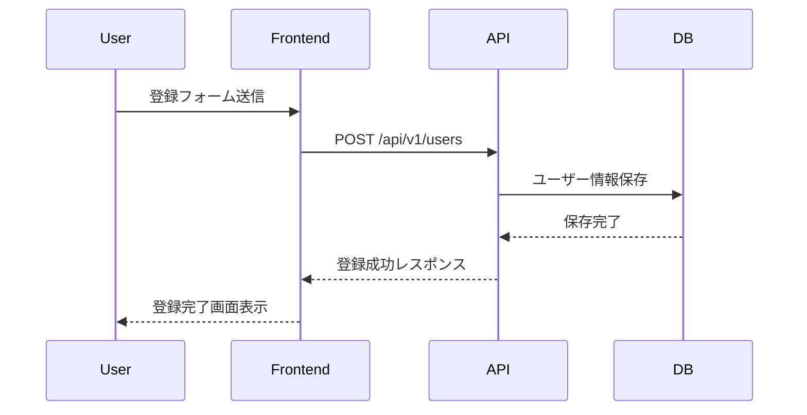

# 設計書: [機能名]

> 生成日: YYYY-MM-DD
> ブランチ: {branch-name}
> ステータス: ドラフト
> 要件定義: [01-requirements.mdへのリンク]

## 1. 設計概要

### 目的
[この設計で何を実現するか]

### スコープ
[この設計でカバーする範囲]

### 前提条件
[設計の前提（要件定義から引用）]

## 2. アーキテクチャ設計

### 選定パターン
**パターン**: [レイヤードアーキテクチャ / マイクロサービス / etc]

**理由**:
- [理由1]
- [理由2]

**メリット**:
- [メリット1]

**デメリット**:
- [デメリット1]

### システム構成図


### コンポーネント一覧

| コンポーネント | 責務 | 技術スタック |
|--------------|------|-------------|
| [Component1] | [...] | [...] |

## 3. データ設計

### ER図


### テーブル定義

#### users

| カラム名 | 型 | 制約 | 説明 |
|---------|---|------|------|
| id | int | PK, AUTO_INCREMENT | ユーザーID |
| name | varchar(100) | NOT NULL | ユーザー名 |
| email | varchar(255) | NOT NULL, UNIQUE | メールアドレス |

### インデックス設計

| テーブル | カラム | 種類 | 理由 |
|---------|--------|------|------|
| users | email | UNIQUE | メールアドレスでの検索が頻繁 |

### 正規化方針

**選定**: 第3正規形

**理由**:
- データ整合性を重視
- パフォーマンスが問題になったら非正規化を検討

## 4. API設計

### API仕様

#### GET /api/v1/users

**説明**: ユーザー一覧を取得

**認証**: 必要

**リクエストパラメータ**:
| パラメータ | 型 | 必須 | 説明 |
|-----------|---|------|------|
| page | int | No | ページ番号（デフォルト: 1） |
| limit | int | No | 1ページあたりの件数（デフォルト: 20） |

**レスポンス例**:
```json
{
  "users": [
    {
      "id": 1,
      "name": "John Doe",
      "email": "john@example.com"
    }
  ],
  "total": 100,
  "page": 1,
  "limit": 20
}
```

**エラーレスポンス**:
| ステータス | 説明 |
|-----------|------|
| 401 | 認証エラー |
| 500 | サーバーエラー |

### 認証・認可

**認証方式**: JWT

**理由**:
- ステートレス
- スケーラビリティが高い

**認可方式**: RBAC

**ロール定義**:
- admin: すべての操作が可能
- user: 自分のデータのみ操作可能

## 5. 非機能要件の設計

### パフォーマンス

**要件**: [要件定義から引用]

**実現方針**:
- **キャッシュ**: Redis使用、TTL 5分
- **DB最適化**: インデックス、クエリ最適化
- **CDN**: CloudFrontで静的ファイル配信

### セキュリティ

**要件**: [要件定義から引用]

**実現方針**:
- **認証**: JWT + リフレッシュトークン
- **認可**: RBAC
- **暗号化**: HTTPS必須、DB暗号化（AWS RDS）
- **入力検証**: すべての入力をサニタイズ

### 可用性

**要件**: [要件定義から引用]

**実現方針**:
- **冗長化**: Multi-AZ構成
- **バックアップ**: 日次自動バックアップ
- **監視**: CloudWatch + PagerDuty

### スケーラビリティ

**要件**: [要件定義から引用]

**実現方針**:
- **水平スケール**: ECS Fargateでオートスケール
- **ロードバランサ**: ALB
- **DBレプリケーション**: マスター-スレーブ構成

## 6. 技術スタック

| レイヤー | 技術 | 理由 |
|---------|------|------|
| Frontend | React | [...] |
| Backend | Node.js + Express | [...] |
| Database | PostgreSQL | [...] |
| Cache | Redis | [...] |
| Infrastructure | AWS | [...] |

## 7. 主要なシーケンス

### ユーザー登録フロー


## 8. 懸念事項・リスク

### リスク1: [リスク名]
- **内容**: [詳細]
- **影響度**: 高/中/低
- **対策**: [対策]

## 9. 今後の検討事項

- [検討事項1]
- [検討事項2]

## 10. 参考資料

- [要件定義書](./01-requirements.md)
- [ADR一覧](../../docs/adr/)

---

**次のステップ**: タスク分解エージェントで実装タスクに分解
